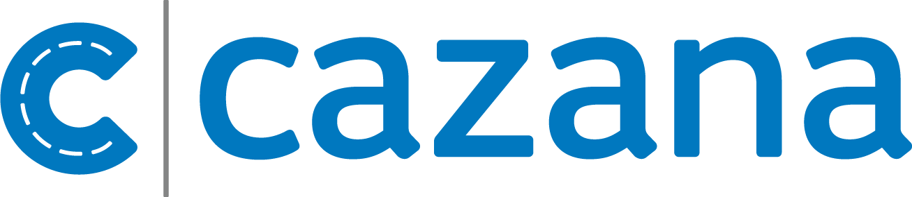

<h4>Hi there, I'm Paul 👋</h4>

<h6>👨‍💻 working on:</h6> 
<ul>
  <li style="vertical-align: middle;">
    Lots of great things at&nbsp;&nbsp;
    <a href="https://trade.cazana.com/" target="_blank" rel="noopener noreferrer">
      
    <a/>
  </li>
  <li>Small personal projects in Python, Svelte and React Typescript 🪀</li>
</ul>

<h6>🌱 currently learning:</h6>
<ul>
  <li>Svelte, React with TypeScript {}</li>
  <li>German, Spanish 💬</li>
  <li>Testing 🧪</li>
  <li>The violin 🎻</li>
  <li>Python 🐍</li>
</ul> 

<h6>🗓 next on the agenda:</h6>
<ul>
  <li>More devops stuff 🐳</li>
  <li>Server-side rendering ⚡︎</li>
  <li>GraphQL 🔗</li>
</ul>

<h6>💭 looking forward to:</h6>
<ul>
  <li>Summer 🏖</li>
  <li>Getting back to the gym 🏋️‍♂️</li>
</ul>

